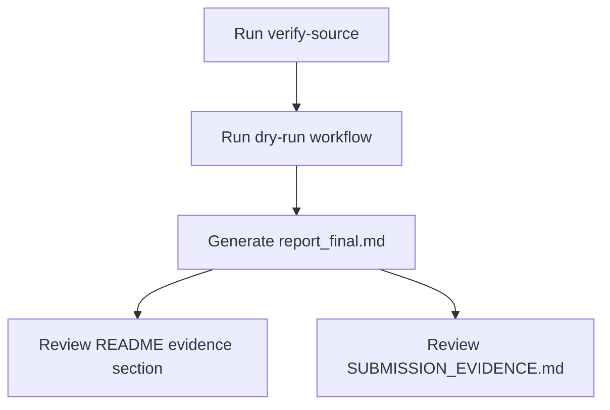

# Design Log #001 - Submission Packaging and Evidence Preservation

## Background

The repository was updated to fix assignment failures, but the README did not explicitly preserve a dedicated "logs/evidence" section. We need a submission-ready package that is easy for reviewers to verify and aligned with project documentation standards.

## Problem

- Reviewers need one clear execution flow and concrete evidence artifacts.
- README needs explicit pointers to run logs and final evidence files.
- Packaging updates should be traceable with a documented rationale.

## Questions and Answers

1. Should we keep both operational docs and reviewer docs?  
   **Answer:** Yes. Keep operational usage in `README.md` and reviewer mapping in `SUBMISSION_EVIDENCE.md`.

2. Should README include full raw logs inline?  
   **Answer:** No. Keep README concise and point to generated artifacts in `output/`.

3. Which artifact is the final handoff report?  
   **Answer:** `output/report_final.md` generated from the latest dry-run.

## Design

- Keep `README.md` as canonical runbook and add an explicit evidence section.
- Keep `SUBMISSION_EVIDENCE.md` as reviewer mapping (feedback -> fix -> proof).
- Generate and preserve `output/report_final.md` for final submission.

## Implementation Plan

1. Generate fresh run and final report artifact.
2. Add `design-log/001-submission-packaging.md`.
3. Update README with explicit "Run Logs and Evidence" section.
4. Re-run tests and ensure docs reference current artifacts.

## Examples

- ✅ Good: README points to `output/report_final.md`, `output/report_latest.md`, and `SUBMISSION_EVIDENCE.md`.
- ❌ Bad: Evidence only in terminal history and not captured in repository docs.

## Trade-offs

- Keeping logs as files (instead of inline README dumps) improves readability.
- Requires one extra command (`report --run-id`) during packaging.

## Verification Criteria

- `output/report_final.md` exists and corresponds to latest run.
- `README.md` contains a section pointing to evidence artifacts.
- `SUBMISSION_EVIDENCE.md` maps each rejection item to concrete proof.

## Implementation Results

- Created this design log.
- Generated fresh run artifact with `run_id=25`.
- Wrote `output/report_final.md`.
- Updated README with a dedicated "Run Logs and Evidence" section.
